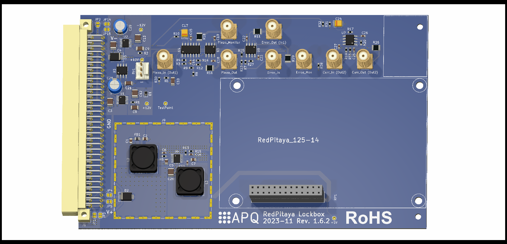

Printed Circuit Boards
===================


All files necessary to build and modify the analog interface for the controller. See *RedPitaya_Lockbox_schematics.pdf* for schematics.


KiCad
-------
[Kicad v. 5.1](https://www.kicad-pcb.org/) design files. Use the files to customize the design.

Gerber
-------
Use the gerber files in this folder to reproduce the design without any changes. Let your PCB manufacturer place the standard SMD components.


BOM
-----
The BOM contains all necessary electronic components. Use [KiBoM](https://github.com/SchrodingersGat/KiBoM) to update the BOM from KiCad:

```python
python "[KiBoM folder]/KiBOM_CLI.py" "%I" "%O" "--cfg=bom.ini"
```